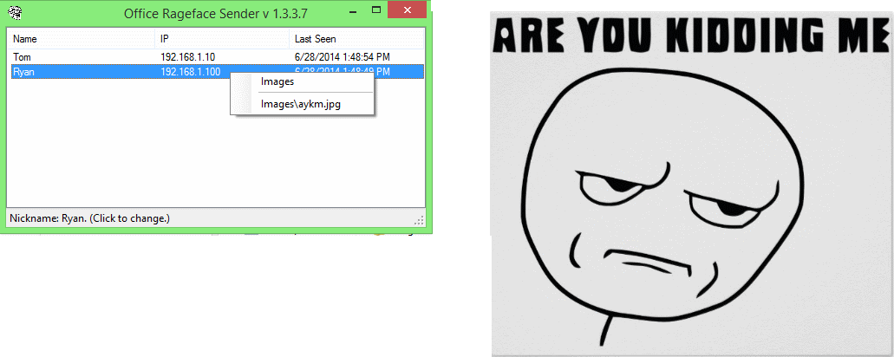

ORS
===

Office Rageface Sender sends ragefaces to other participants on the local network (LAN). Just dump all your images into the Images subfolder, right-click on the person's name and 
send them whichever image you want. The image will briefly flash on their screen. Bonus - if the recipient doesn't have the same images as you do - his or her client will automatically download your rageface when you send it to them!

WARNING: Only run this on networks you trust, with other people that you trust. Run this at your own risk. I'm not responsible for you getting chewed out by your boss at the office because you guys started sending each other boob pics.

